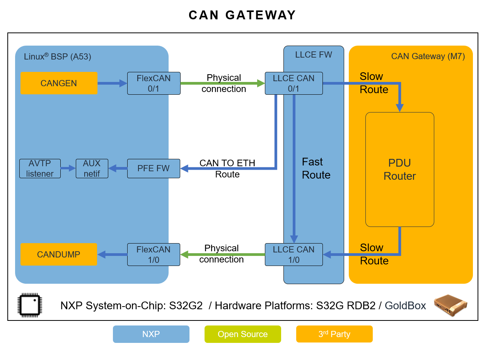

===========
CAN Gateway
===========

The CAN gateway is based on EB Tresos AutoCore Platform for S32G27X.
It is distributed in binary and source code format.
It is loaded from the QSPI Flash, then booted to Cortex-M7 core 0 of S32G27X platform, by the bootloader.

GoldVIP provides the canperf script to generate CAN traffic from Linux/A53 on Flex-CAN
and measure CAN forwarding performance between two LLCE-CAN ports connected to
two Flex-CAN ports.

The following architecture was employed:

The CAN gateway currently supports the following use cases:
 - CAN to CAN 1:1 frame routing on Cortex-M7 core (Slow route).
   The CAN packets are sent from Linux and received on the M7 through the LLCE filters, then passed
   through the PDU router instance running on the M7 core.
 - CAN to CAN 1:1 frame routing on LLCE (Fast Route)
   The CAN packets are sent from Linux and received on the LLCE. As opposed to the previous use case,
   the packets are routed directly by the LLCE, without any M7 core intervention.
 - CAN to ETH and CAN 1:1 frame routing on LLCE (Can to Ethernet Route).
   The CAN packets are sent from Linux and received on the LLCE. The packet will then be routed by the LLCE
   firmware to the output LLCE CAN instance. The packet will then be formatted into AVTP format and sent to the PFE.
   The packets sent to the PFE firmware are then captured on the AUX0 interface as inbound traffic.
   When the canperf script detects that the injected packets will also be sent to the AUX0 interface, a network service
   listener, namely "avtp_listener", will start to capture AVTP packets and log them to a file. In this case, the canperf
   script will also report how much data was captured by the ethernet service listener.
 - CAN to ETH routing through M7 core.
   The CAN packets are sent from Linux and received on the M7 CAN driver from where they are passed to the Autosar COM
   stack which forwards it to the PFE2. The format used for the ethernet packets is UDP.

Prerequisites
-------------
- S32G-VNP-RDB2 board running GoldVIP images

Running the measurements
------------------------
1. About:

   These commands will measure throughput of CAN frames routing between the configured CAN ports (``-t can0 -r can1``).
   The used CAN frames are 8(``-s 8``) to 64-bytes in size. A configured ms gap(``-g 10``) is used between consecutive frames.

2. HW setup:

   Connect Flex-CAN0 to LLCE-CAN0 and Flex-CAN1 to LLCE-CAN1. To locate the CAN
   connector and pins check the figures from the appendix. The CAN wires should
   be directly connected High to High and Low to Low.

3. Run CAN perf script:

   a) Parameter description:

      - | ``-t`` CAN transmit interface -use the values as per CAN-GW configuration. For the default CAN-GW configuration provided in GoldVIP, use the values as indicated for each flow(e.g. slow path, fast path, ...) in below sub-chapters
      - | ``-r`` CAN receive interface -use the values as per CAN-GW configuration. For the default CAN-GW configuration provided in GoldVIP, use the values as indicated for each flow(e.g. slow path, fast path, ...) in below sub-chapters
      - | ``-i`` id of transmit CAN frame -use the values as per CAN-GW configuration. For the default CAN-GW configuration provided in GoldVIP, use the values as indicated for each flow(e.g. slow path, fast path, ...) in below sub-chapters
      - | ``-o`` id of receive CAN frame -use the values as per CAN-GW configuration. For the default CAN-GW configuration provided in GoldVIP, use the values as indicated for each flow(e.g. slow path, fast path, ...) in below sub-chapters
      - | ``-s`` CAN frame data size in bytes
      - | ``-g`` frame gap in milliseconds between two consecutive generated CAN frames, use any integer >= 0
      - | ``-l`` the length of the CAN frames generation session in seconds, use any integer > 1

   b) For slow route:

      - Use the following arguments combinations which match the GoldVIP default configuration for CAN-GW

       | -t can0 -r can1 -i 0 -o 4
       | -t can1 -r can0 -i 2 -o 3

       ex: ``./canperf.sh -t can0 -r can1 -i 0 -o 4 -s 8 -g 10 -l 10``

      - Optionally, one can use the default script provided in the can-gw directory: can-slow-path.sh

        ex: ``./can-slow-path.sh``

   c) For fast route:

      - Use the following arguments combinations which match the GoldVIP default configuration for CAN-GW

       | -t can0 -r can1 -i 245 -o 245
       | -t can1 -r can0 -i 246 -o 246

       ex: ``./canperf.sh -s 64 -g 10 -i 245 -o 245 -t can0 -r can1 -l 10``

      - Optionally, one can use the default script provided in the can-gw directory: can-fast-path.sh

        ex: ``./can-fast-path.sh``

   d) For can to ethernet route fast path:

      - Use the following arguments combinations which match the GoldVIP default configuration for CAN-GW

       | -t can0 -r can1 -i 228 -o 228
       | -t can1 -r can0 -i 229 -o 229

       ex: ``./canperf.sh -s 64 -g 10 -i 228 -o 228 -t can0 -r can1 -l 10``

      - Optionally, one can use the default script provided in the can-gw directory: can-to-eth.sh

        ex: ``./can-to-eth.sh``

   Note: Please run ``./canperf.sh -h`` to see all the available options.

4. Running CAN to ethernet slow path:

   a) Connect one host PC ETH port to the board's PFE-MAC2 ETH port.

   b) Start GoldVIP Docker container on PC (see :ref:`building_goldvip_docker_image` chapter)

   c) Run on host PC can-to-eth-slow-path-m7-host.sh script to measure performance for CAN to
      ethernet routing, with various payload sizes and time gaps between CAN frames e.g.::

        sudo ./eth-slow-path-host.sh -s 64 -g 10 <can> <eth>

      Note: run ``ip a`` command on your host PC to find out the exact name of the
      ethernet interface <eth> connected to the board.
      
      Note: The script is connecting to target console via */dev/ttyUSB0*. In case
      tty port is different on your PC, specify it explicitly with *-u* argument,
      e.g., *-u /dev/ttyUSB1*. Also, no other process should use the port during the test.

 

Updating the EB AutoCore
------------------------

The distributed CAN-GW binary is compiled from an EB Tresos AutoCore Platform that requires some patches and updates for the Tresos plugins to get the same functionality as in the distributed binary image:

1. Patch the OS plugin:

These patches can be found under `<GoldVIP_install_path>/configuration/can-gw/patches` and they shall be applied on the OS plugin that can be found under `<EB_Tresos_install_path>/plugins/Os_TS_T40D33M6I0R0`.
There are various ways of applying these patches, such as using the UNIX `patch` tool (i.e., ``patch -p0 < <file.patch>``) or a git-specific command like `git apply` (i.e., ``git apply -p0 <file.patch>``).
For example, one can use the following commands to apply all the existing patches::

  cd <EB_Tresos_install_path>/plugins/Os_TS_T40D33M6I0R0
  git apply -p0 <GoldVIP_install_path>/configuration/can-gw/patches/*.patch
  
2. Update NXP plugins:

Replace the `McalExt_TS_T40D33M1I0R0` plugin found in the `<EB_Tresos_install_path>/plugins/` directory with 
the contents of the `McalExt_TS_T40D33M1I0R0.zip` archive, which can be found in the `<GoldVIP_install_path>/configuration/can-gw/plugins` directory. 

**Note**: EB Tresos needs to be restarted after performing this change, in order to load the newly installed plugins. 