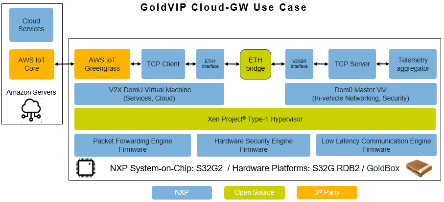

Cloud Edge Gateway
==================

Introduction
------------
The Cloud Edge Gateway use case demonstrates telemetry to cloud using AWS Greengrass.
Telemetry statistics are fetched from the device, calculated and sent to the
cloud counterpart of the application. Statistics received in the cloud are then
displayed into user-friendly graphs. The statistics include but may not be limited to:
Networking accelerator usage statistics, Realtime cores load, Domain-0 VCPU load and
Domain-0 Memory utilization statistics.

The following architecture was employed:

The following access policies to hardware resources are applicable for the virtual machines
(Domain-0 and v2xdomu) described in :ref:`xen_hypervisor` chapter:

- Domain-0 has access to all the hardware resources in the system.

- v2xdomu has access to limited resources which are virtualized by XEN.

Telemetry data is collected from Domain-0 and passed to v2xdomu through a
TCP client-server communication. The Domain-0 v2xbr is a virtual switch with no outbound
physical interface attached to it. This connection is used to pass telemetry data from
Domain-0 to v2xdomu and vice-versa, without outside interference or snooping possibility.
Any change in the configuration (update of the telemetry interval from the cloud) is
communicated from cloud to the Dom0 TCP Server, via the TCP client available on v2xdomu.
This ensures that the system resources are protected from outside interference.
Data is prepared for fetching in the Domain-0 at any given time via a telemetry service
(see ``/etc/init.d/telemetry``) which is started at boot time.

Prerequisites
-------------

- AWS account with SSO enabled. Follow the steps in this guide to enable SSO:
  https://docs.aws.amazon.com/singlesignon/latest/userguide/getting-started.html

  Enabling SSO will grant you access to the SSO console.
  SSO is also required to use the SiteWise Dashboard.
- S32G board with the GoldVIP image deployed and an internet connection.

  Note: Greengrass uses ports 8883 and 8443. As a
  security measure, restrictive environments might limit inbound and outbound
  traffic to a small range of TCP ports, which might not include these ports.
  Therefore the provisioning script (described in chapter
  :ref:`connecting-the-board-to-aws`) changes these ports to 443.
  To use the default ports (8883 and 8443) use the arguments
  --mqtt-port and --http-port from the provisioning script.

AWS IAM Permissions
-------------------

A policy for an AWS IAM user, it contains the necessary
permissions for the deployment and use of the telemetry use case::

  {
    "Version": "2012-10-17",
    "Statement": [
      {
        "Effect": "Allow",
        "Action": [
          "cloudformation:*",
          "cloudwatch:*",
          "iot:*",
          "lambda:*",
          "logs:*",
          "s3:*",
          "greengrass:*",
          "sns:*",
          "iotsitewise:*",
          "iam:*",
          "sso:*",
          "sso-directory:*"
        ],
        "Resource": "*"
      }
    ]
  }

AWS IAM documentation:
https://docs.aws.amazon.com/IAM/latest/UserGuide/getting-started_create-delegated-user.html

Supported Regions
-----------------

- ``Oregon``: ``us-west-2``
- ``Ireland``: ``eu-west-1``

Select in the AWS Console the region you desired from the list of supported regions.

Deployment of the Telemetry Stack in AWS
----------------------------------------

1. Go to the AWS SAR console: https://console.aws.amazon.com/serverlessrepo/
2. Go to ``Available applications`` tab; then to ``Public applications`` and
   search for ``goldvip``.
3. Check ``Show apps that create custom IAM roles or resource policies``
   to see the application.
4. Click on ``nxp-goldvip-telemetry``. You can modify the application parameters.
5. Check ``I acknowledge that this app creates custom IAM roles.``
6. Click ``Deploy``. The deployment will take a few minutes. You will be
   redirected to another page. The name of the stack is on the top of the page,
   starting with ``serverlessrepo-``, if you changed the application name
   you will need this name in the next step.
   You can go to the ``Deployments`` tab and
   see the status of the deployment. Wait for the status to change from
   ``Create in progress`` to ``Create complete``.
   Note: you may need to refresh the page to see the status change.

This CloudFormation stack creates on your account:

- A Greengrass Group (Classic V1); this manages the connection between the board and the AWS cloud.
- A SiteWise Portal with a Dashboard; after the board is connected to AWS, a live visual representation
  of the telemetry data received via Greengrass is displayed.

.. _connecting-the-board-to-aws:

Connecting the board to AWS
---------------------------

1. Log into the V2X Virtual Machine using the command: ``xl console v2xdomu``

2. Configure environment variables for Greengrass provisioning script:

  From the V2Xdomu console, set the AWS credentials as environment variables::
   
     $ export AWS_ACCESS_KEY_ID=<access key id>
     $ export AWS_SECRET_ACCESS_KEY=<secret access key>

  One way of obtaining your AWS credentials is the following:

   From the AWS SSO console select your account and retrieve the environment variables
   by clicking on ``Command line or programmatic access``. From section ``macOS and Linux``
   copy the variables and paste them on your board. Use Option 1: set the AWS
   credentials as environment variables.

  Please check the AWS documentation for additional information: https://docs.aws.amazon.com/cli/latest/userguide/cli-configure-envvars.html

  Note: 
    - IAM credentials should never be used on a device in production scenario.
    - These variables are temporary and are erased at reboot.

3. Run the Greengrass provisioning script on your board:

   ``$ python3 ~/cloud-gw/greengrass_provision.py --stack-name <stack-name> --region-name <region-name>``

   Where ``<stack-name>`` is the name of the deployed stack. If you did not
   change the application name you do not need to specify this parameter.
   In ``<region-name>`` put the region you have selected from the supported ones:
   ``us-west-2`` or ``eu-west-1``.

   This will setup the network interface and deploy the Greengrass group created by
   the telemetry application.

   Note: the provisioning script will try to setup the internet connection using the
   ``eth0`` network interface by default.

   To get more details about the script parameters use:

   ``$ python3 ~/cloud-gw/greengrass_provision.py -h``

The board is now connected to your AWS account and it will begin to send
telemetry data.

In some cases, DHCP client is running for each of the PFE interfaces (PFE0 and PFE2),
hence 2.5 Mbps spikes can be observed in the AWS SiteWise dashboard. To close the DHCP
client, it is necessary to run the command ``killall udhcpc``  in the Dom0 console. This
will close the DHCP client and the spikes will no longer be observed in the dashboard.

Note: The deployment of the Greengrass group has to be done only once. The network configuration
and time are not persistent between reboots. Please check :ref:`config-telemetry-after-reboot`
for further information.

Accessing the SiteWise dashboard
--------------------------------

1. Go to the SiteWise console: https://console.aws.amazon.com/iotsitewise/
2. Click on ``Portals`` from the list on the left.
3. Click on the name of your portal,
   it starts with ``SitewisePortal_serverlessrepo``.
4. Click on ``Assign administrators``
5. Add your account and any other you want to have access to the
   SiteWise Dashboard.
6. Click ``Assign administrators``.
7. Click on the Portal's Url (or Link).
8. Close the ``Getting started`` pop up window.
9. Click on ``Dashboard``.

You will now see the live telemetry data from your board.

Testing the Telemetry Application
---------------------------------

1. Log into the Domain-0 virtual machine as described in chapter (:ref:`xen_hypervisor`).

2. Simulate core load:

   - Execute a computationally intensive task to generate CPU load:

     ``dd if=/dev/zero of=/dev/null &``

     This process will be assigned to one of the available cores and will run in the background. An increase
     of 25% on the core load shall be observed in the AWS console, per each of the started processes.

   - Kill all cpu loading processes:

     ``killall dd``

Deleting the Telemetry Application
----------------------------------

1. Go to the SiteWise console: https://console.aws.amazon.com/iotsitewise/
2. Click on ``Portals`` from the list on the left.
3. Click on the name of your portal,
   it starts with ``SitewisePortal_serverlessrepo``
4. Remove all administrators and users from the portal.
5. Go to Cloudformation: https://console.aws.amazon.com/cloudformation/
6. Select your stack and delete it.

.. _config-telemetry-after-reboot:

Configure Greengrass after reboot
---------------------------------

Greengrass will start after every following board reboot if the telemetry application was
successfully deployed on the board.

The network configuration is not persistent between reboots, so it must be recreated for internet
connection.

- Log into the V2X domU as described in chapter (:ref:`xen_hypervisor`).

- The provision script can be used again to configure the network interface that will be used by
  Greengrass:

  ``$ python3 ~/cloud-gw/greengrass_provision.py --no-deploy --netif <net-dev>``

  Where ``<net-dev>`` is the network interface that shall be configured.

- Alternatively, other commands could be used:

  Acquire an IP address, by running the DHCP client:

    ``$ udhcpc -i <net-dev>``

  Synchronise date and time (restart ntpd):

    ``$ killall ntpd && ntpd -gq``